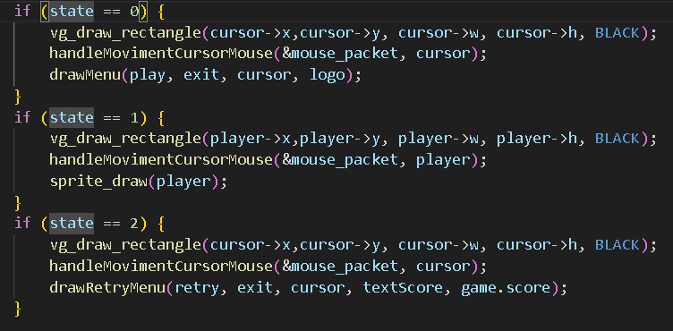
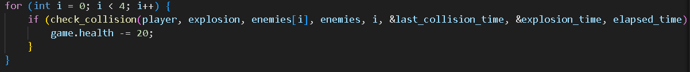
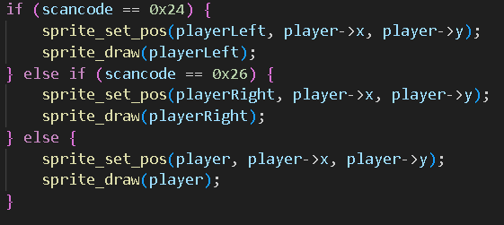
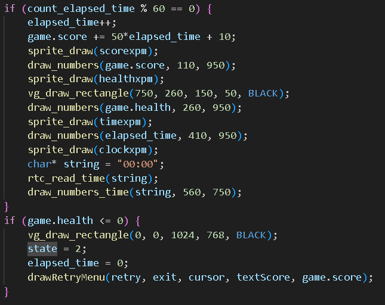

# LCOM Project

LCOM Project for group T18 G06

Group members:

1. Jorge Mesquita (202108614)
2. Bruno Huang

### Goal
This project was made in the scope of the curricular unit LCOM of the course Engineering of Informatic and Computation at the Faculty of Engineering at the University of Porto.

The goal is to apply all the theory and practice we adquired along the semester and develop a project. We chose to delevop a game for the MINIX.

## Section 1 (Overview)

### DodgeLite

DodgeLite is a mini-game in which the goal is to dodge the travelling planes. As you survive through the game, they start to travelling faster and the damage taken is higher!

### Menu

When you open the game, you will come across with a menu with the options to start or exit the game.

You can move the cursor with the "I" (up), "J" (left), "K"(down) and "L" (right) letters or, if you prefer, you can use the mouse to move the cursor! To click, you can use the spacebar!

### Gameplay

When you start the game, your environment will have the following layout:

#### Player and Enemies

* You are the blue and red plane and you should avoid hitting the others planes. They will always travel in the same direction and respawn at other location.

#### Score

* As you progress through the game, the difficulty will increase. To compensate, you will earn more score!

#### Health

* This represents your health. Each time you make a collision, your health decreases. Once you reach 0 health, the game will finish.

#### Time

* This represents the time elapsed in seconds!

#### Clock

* This represents the real time in HH:MM format!

### Exit

Once your game finishes, you will be taken to a menu which provides your score and gives you the options to start again the game or exit the program.

## Section 2 (Project Status)

### Implemented Functionalities

All the planned functionalities were implemented.

### Used I/O Devices

The following table provides the I/O devices used for this project:

<table>
    <tr><td>Device</td><td>What for?</td><td>Interupt or Polling?</td></tr>
    <tr><td>Timer</td><td>-> Control elapsed time; -> Handle critical elements, such as the health and the score; 
    -> Update dynamic elements, such as enemies' moviment or updates from RTC.</td><td> Interrupt</td></tr>
    <tr><td>KBD</td><td>-> Control moviment of the cursor or player during the menu or the gameplay; 
    -> Handle collisions for the respective moviment.</td><td>Interrupt</td></tr>
    <tr><td>Mouse</td><td>-> Handle the moviment of the cursor for the menu only.</td><td>Interrupt<td></tr>
    <tr><td>Video Card</td><td>-> Screen display.</td><td> N/A</td></tr>
    <tr><td>RTC</td><td>-> Display real time clock.</td><td>Interrupt</td></tr>
</table>

### Timer

The timer is crucial for giving a dynamic experience for the player. It is used to control the elapsed time and handle important features, such as the health and the score. 

If the players reaches 0 health, the gameplay should finish and redirected the player to the menu screen.

If a second is elapsed, the timer will call other functions to update some screen elements, such as the score, health, time elapsed and clock.

#### Interrupt:

### KBD

The keyboard is important to provide the interaction between the game and the player. For example, if the player clicks the letter "I", the cursor/character will move up. 

Before moving, it should check if it is possible to move to the respective direction or if it is going to lead to a collision with the wall or an enemy.

#### Interrupt:

#### Important functions called:

##### handleClick():

##### handleMoviment():

### Graphics Card

The chosen video mode for our game is the indexed mode with a resolution of 1024x768. This mode has 64 colors. We provide an index as a clor to access the respective color of the MINIX's pallete.

To reduce the flickering, we implemented the double buferring, via copy. This allows a smooth experience for the player.

When the player makes a moviment, the plane changes its sprite to a plane tilted to the respective side and goes back to the original sprite, providing a simple animated sprite.

When there is a collision, the enemy and the player will crash and leave an explosion behind. The enemy is going to disappear and the player will respawn in a safer area. 

### Mouse

It has the same purpose as the keyboard. It allows the player to interact with the game and move only the cursor. It doesn't interact with its buttons.

#### Interrupt: 

#### Important functions called:

##### handleMovimentCursorMouse()

### RTC

The RTC is used to gather the time. It doesn't have a specific if-statement to read the irq_set line, althought it is called in the timer interrupt to update the clock element in the screen.

#### Important functions called:

##### rtc_read_time()

## Section 3 (Code Organization/Structure)

### timer.c & i8254.h (10%)

These files contain all the code developed in the Lab 2. It is responsible to provide all the functions to interact with the MINIX's timer.

### keyboard.c & keyboard.h (10%)

These files contain all the code developed in the Lab 3. It is responsible to provide all the functions to interact with the MINIX's keyboard.

### mouse.c & mouse.h (10%)

These files contain all the code developed in the Lab 4. It is responsible to provide all the functions to interact with the MINIX's mouse.

### graphic.c & graphic.h (10%)

These files contain all the code developed in the Lab 5. It is responsible to provide all the functions to interact with the MINIX's graphics card.

### sprite.c & sprite.h (10%)

These files contain the complementary code for the Lab 5. It is responsible to provide a structure for xpm images for its use in the screen desplay.

### rtc.c & rtc.h (10%)

These files contain all the code developed in the Lab 6. It is responsible to provide all the functions to interact with the MINIX's RTC.

### game.c & game.h (20%) 

These files contain all the code necessary for the game architecture. It is responsible to handle many things for the game, such as the moviment of the character and the use of auxiliary functions to implement screen elements.

### proj.c (20%)

This is the main file for the project. It is responsible for the implementation of the main loop of the game and resort to the LCF.

### Function Call Graph (Doxygen)

[Não sei como fazer esta parte!]

## Section 4 (Implementation Details)

### States

It is very important to know in which screen we are to adapt the behaviour of our devices. For instance, if we are in the menu, we need only to control the cursor. However, if we are in the game, we need to control the player and not the cursor. 

Let's see the example of the mouse:

* State 0 - Initial Menu;
* State 1 - Gameplay;
* State 2 - End Game Menu.

If the mouse receives an interrupt and the game is in the state 0 or 2, it will update the position of the cursor according to the respective interrupt. If it is in the state 1, it will update the player's position instead.

### Collisions

#### Boundaries

The player has a limited space where he can move. He isn't supposed to cross the blue walls. To verify if the input from the player is valid, we should use a if-statement to check if it isn't going beyond boundaries.

Let's see an example:

Beforehand, we should check if it is the player or the cursor for which we are calling the function.

If it is the player, his moviment should be inside the arena. If the moviment doesn't respect the boundaries, it won't move. The same goes to the cursor. It should be inside the screen.

#### Enemies

One of the main aspects of the game is the collision with enemies. If the player collides with an enemy, he will lose health. After each input from the keyboard or the mouse, the code will check if the player's sprite intersects with an enemy's sprite.

If the result of the function is true, we will reduce the player's health.

### Moviment of the Sprites

When we want to reflect the moviment of the elements, we should update constantly the screen with the respective new positions. However, we should erase the pixels from the previous position to avoid leaving a trail.

The next steps are important:

1. Leave a black rectangle in the current position;
2. Update to the new position;
3. Draw the sprite in the new position.

These steps will make the moviment smoother and it won't leave a trail.

### Animated Sprites

Since our game envolves planes, we could make a quick animated sprite when the players moves. It the player turns right, the plane will tilt to the right and move to the new position, returning to the normal sprite.

This can be achieved by the following implementation:

The character will display temporarily a sprite which is tilted to the respective direction, followed by the normal sprite.

### Game's Life Cycle

During the game, the different values need to be updated. Each time the program receives an interrupt for the timer, it will increase a counter. If that counter reaches a number that is divisible by 60, it means it has elapsed 1 second.

In each second, we will update those values. Let's check the following code:

As we can see, we will have a sprite for each element and the respective label. In each second, the score and the elapsed time will increase linearly with the elapsed time. The health will be updated according to the player's health and the clock will be updated with the retrieved time from the RTC.

If the player's health reaches a value lower or equal than zero, the game will change to the state 2 (End Game Menu) and will draw the respective result, marking the end of the game. The player will have the possibility to start again!

## Section 5 (Conclusions)

This was one of the projects where we acquired several skills during its execution. It was possible to explore new concepts, going beyond the skills of the curricular unit, and, essentially, it was possible to consolidate the skills acquired. 

It is important to note that we had to invest more time and effort in the project, since two of our group members didn't participate.

We complied with 100% of the mandatory parameters (Timer, KBD and Graphics Card) and explored some optional ones (Mouse and RTC). Having said that, we consider that this project was successful and we performed very well according to our expectations!

