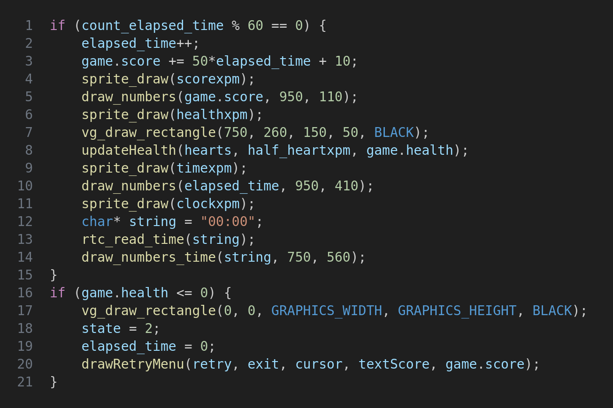

# LCOM Project

LCOM Project for group T18 G06

Group members:

|  Name          |  ID         |
|----------------|-------------|
| Jorge Mesquita | 202108614   |
| Bruno Huang    | 202207517   |

## Project Overview

This project was developed as part of the Laboratory of Computers (LCOM) course in the Informatics and Computing Engineering program at the Faculty of Engineering, University of Porto. 

The primary objective of this project was to apply the theoretical knowledge and practical skills acquired throughout the semester to develop a game. 

The game was developed using the LCF framework and runs on the MINIX operating system.

## Section 1 (User's instructions)

### DodgeLite

DodgeLite is a mini-game where the primary objective is to survive as long as possible by skillfully dodging incoming planes. As the game progresses, the planes start to travel faster, increasing the challenge and excitement.

To add a strategic twist, players are also equipped with a limited number of shots. These can be used to take down incoming planes, providing temporary relief and extending survival time. However, with limited ammunition, players must decide when to dodge and when to strike for optimal survival.

### Menu

When you open the game, you will come across a user-friendly menu offering options to start or exit the game.

You can move the cursor with the "I" (up), "J" (left), "K"(down) and "L" (right) letters or, if you prefer, you can use the mouse to move the cursor! To click, you can use the spacebar!

### Gameplay

When you start the game, your environment will have the following layout:

#### Player and Enemies

* You control the purple and green plane. Your objective is to avoid collisions with other planes. These planes consistently travel in a fixed direction and, upon leaving the screen, will respawn at a new location.

#### Score

* As you advance in the game, the challenge intensifies. However, with increased difficulty comes greater rewards - your score will increase at a faster rate!

#### Health

* The displayed points represent your health. Each collision with another plane deducts points. When your points reach zero, the game concludes.

#### Time

* This displays the time you've survived in the game, measured in seconds!

#### Clock

* This displays the current real-world time in the format of hours and minutes (HH:MM)!

### Exit

Upon the conclusion of your game, you'll be directed to a menu that displays your score and offers the options to either restart the game or exit the program.

## Section 2 (Project Status)

### Implemented Functionalities

All the planned functionalities were implemented.

### Used I/O Devices

The following table provides the I/O devices used for this project:

<table>
    <tr>
        <td>Device</td>
        <td>What for?</td>
        <td>Interupt or Polling?</td>
    </tr>
    <tr>
        <td>Timer</td>
        <td>-> Control elapsed time; 
        -> Handle critical elements, such as the health and the score; 
        -> Update dynamic elements, such as enemies' movement or updates from RTC.</td>
        <td> Interrupt</td>
    </tr>
    <tr>
        <td>KBD</td>
        <td>-> Control movement of the cursor or player during the menu or the gameplay; 
        -> Handle collisions for the respective movement.</td>
        <td>Interrupt</td>
    </tr>
    <tr>
        <td>Mouse</td>
        <td>-> Handle the movement of the cursor for the menu only.</td>
        <td>Interrupt<td>
    </tr>
    <tr>
        <td>Video Card</td>
        <td>-> Screen display.</td>
        <td> N/A</td>
    </tr>
    <tr>
        <td>RTC</td>
        <td>-> Display real time clock.</td>
        <td>Interrupt</td>
    </tr>
</table>

### Timer

The timer plays a pivotal role in providing a dynamic gaming experience. It not only controls the elapsed time but also manages key game features such as health, score, enemy and shots movements.

If the player's health reaches zero, the gameplay concludes and the player is redirected to the menu screen.

Once a second has elapsed, the timer triggers various functions to update on-screen elements, including the score, health, and elapsed time.

#### Interrupt:

### KBD

The keyboard serves as a crucial interface for player-game interaction. For instance, pressing the "I" key moves the cursor or player upwards.

#### Interrupt:

#### Important functions called:

##### handleClick():

##### handleMovement():

### Graphics Card

The selected video mode for our game is the direct color mode with a resolution of 1152x864, denoted by the mode number 0x14C. This mode supports 32-bit color depth, providing a rich palette of colors for a vibrant gaming experience. Each pixel's color is specified directly by distinct red, green, and blue components, each represented by 8 bits.

To minimize screen flickering and enhance the player's experience, we implemented double buffering through a copy method, ensuring smoother gameplay.

When the player initiates a left or right movement, the plane's sprite changes to depict a tilt towards the respective direction. It then reverts back to the original sprite, creating a simple yet effective horizontal movement animation. No animation occurs for up or down movements.

In the event of a collision, both the player and the enemy crash, leaving behind an explosion. The enemy disappears and respawns at a random location, while the player respawns at a designated safe area. For one second following the respawn, the player is granted invulnerability, during which collisions with enemies will have no effect.

When a shot hits an enemy, it also results in an explosion. The enemy then disappears and respawns at a random location.

### Mouse

Like the keyboard, it serves as an interface for player-game interaction, allowing the player to move the cursor. However, its buttons do not interact with the game.

#### Interrupt: 

#### Important functions called:

##### handleMovementCursorMouse()

### RTC

The Real-Time Clock (RTC) is utilized to obtain the current time. While it doesn't have a dedicated if-statement to read the irq_set line, it is invoked during the timer interrupt to update the on-screen clock element.

#### Important functions called:

##### rtc_read_time()

## Section 3 (Code Organization/Structure)

### timer.c & i8254.h (10%)

These files encompass all the code developed during Lab 2. They are responsible for providing all the necessary functions to interact with MINIX's timer.

### keyboard.c & keyboard.h (10%)

These files encompass all the code developed during Lab 3. They are responsible for providing all the necessary functions to interact with MINIX's keyboard.

### mouse.c & mouse.h (10%)

These files encompass all the code developed during Lab 4. They are responsible for providing all the necessary functions to interact with MINIX's mouse.

### graphic.c & graphic.h (10%)

These files encompass all the code developed during Lab 5. They are responsible for providing all the necessary functions to interact with MINIX's graphics card.

### sprite.c & sprite.h (10%)

These files encompass the supplementary code developed during Lab 5. They are responsible for providing a structure for XPM images, facilitating their display on the screen.

### rtc.c & rtc.h (10%)

These files encompass all the code developed during Lab 6. They are responsible for providing all the necessary functions to interact with MINIX's Real-Time Clock (RTC).

### game.c & game.h (20%) 

These files encompass all the code necessary for the game's architecture. They handle various aspects of the game, including character movement and the use of auxiliary functions to implement on-screen elements.

### proj.c (20%)

This is the primary file for the project. It is responsible for implementing the game's main loop and relies on the LCF.

### Function Call Graph (Doxygen)

TO BE DONE

## Section 4 (Implementation Details)

### States

It is very important to know in which screen we are to adapt the behaviour of our devices. For instance, if we are in the menu, we need only to control the cursor. However, if we are in the game, we need to control the player and not the cursor. 

Let's see the example of the mouse:

* State 0 - Initial Menu;
* State 1 - Gameplay;
* State 2 - End Game Menu.

If the mouse receives an interrupt and the game is in the state 0 or 2, it will update the position of the cursor according to the respective interrupt. If it is in the state 1, it will update the player's position instead.

### Collisions

#### Boundaries

The player is confined to a specific area and is not allowed to cross the boundaries. To ensure the player's input is valid, an if-statement is used to check that the player is not attempting to move beyond these boundaries.

Let's see an example:

Beforehand, we should check if it is the player or the cursor for which we are calling the function.

If it is the player, its movement should be inside the arena. If the movement doesn't respect the boundaries, it won't move. The same goes to the cursor. It should be inside the screen.

#### Enemies

A key aspect of the game is the interaction with enemies. If the player's sprite intersects with an enemy's sprite, indicating a collision, the player loses health. This check is performed continuously during the game.

Should the function return true, the player's health will be decreased.

### Movement of the Sprites

To accurately reflect the movement of game elements, the screen must be constantly updated with their new positions. Simultaneously, pixels from their previous positions should be erased to prevent leaving a visual trail.

The following steps are crucial:

1. Overlay a black rectangle at the current position to erase the sprite;
2. Update the sprite's coordinates to the new position;
3. Draw the sprite at the updated position.

Executing these steps ensures smoother movement of the sprite without leaving a visual trail.

### Animated Sprites

Given that our game involves planes, we can create a quick animated sprite when the player moves. If the player turns right, the plane will tilt to the right and move to the new position, before reverting back to the original sprite. The 
same happens when tilting to the left.

This can be achieved by the following implementation:

The plane will temporarily display a sprite tilted in the respective direction, before reverting back to the normal sprite.

### Game's Life Cycle

Throughout the game, various values require updating. Each time the program receives a timer interrupt, a counter is incremented. When this counter reaches a value divisible by 60, it signifies that one second has elapsed.

In each second, we will update those values. Let's check the following code:

As we can see, we will have a sprite for each element and the respective label. In each second, the score and the elapsed time will increase linearly with the elapsed time. The health will be updated according to the player's health and the clock will be updated with the retrieved time from the RTC.

If the player's health reaches a value lower or equal than zero, the game will change to the state 2 (End Game Menu) and will draw the respective result, marking the end of the game. The player will have the possibility to start again!

## Section 5 (Conclusions)

This was one of the projects where we acquired several skills during its execution. It was possible to explore new concepts, going beyond the skills of the curricular unit, and, essentially, it was possible to consolidate the skills acquired. 

It is important to note that we had to invest more time and effort in the project, since two of our group members didn't participate.

We complied with 100% of the mandatory parameters (Timer, KBD and Graphics Card) and explored some optional ones (Mouse and RTC). Having said that, we consider that this project was successful and we performed very well according to our expectations!

